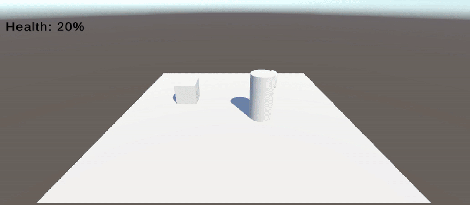

# HealthSystem – Unity Observer Pattern

A Unity project demonstrating the **Observer Pattern** for a decoupled, event-driven Health System.  
Implements a `Health` subject that notifies multiple observers (UI, Audio, Logger) and includes a **GameOver system** as a bonus feature.

---

## 🎯 Features

- **Observer Pattern** implemented using C# events (`Action<T>`) and typed event arguments.
- **Observers included:**
  - **UI_Observer** → Displays health as text (TextMeshPro)
  - **Audio_Observer** → Plays damage, heal, and death sounds
  - **Log_Observer** → Logs health changes to the Console
  - **GameOver_Observer** → *(Bonus)* Shows a Game Over image with fade effect and disables player control
- **Dynamic Subscribe/Unsubscribe** using `+=` and `-=` in `OnEnable`/`OnDisable`
- Clean, modular code with separation of concerns
- Simple demo scene for testing

---

## 🗂 Project Structure

```
Assets/
├── Audios/	 # Contains SFX for damage, heal, and death
│   ├── die.mp3
│   ├── heal.mp3
│   └── hurt.mp3
├── Scenes/
│   └── Game.unity	# Main playable scene with all setup
├── Scripts/
│   ├── Gameplay/	# Player and environmental interaction scripts
│   │   ├── Hazard.cs
│   │   ├── Medicine.cs
│   │   └── PlayerController.cs
│   ├── HealthSystem/	# Core logic: Health subject, interfaces, event data
│   │   ├── Health.cs
│   │   ├── HealthEventArgs.cs
│   │   ├── IHealthObserver.cs
│   │   └── IHealthSubject.cs
│   └── Observers/	# Event-driven scripts (UI, Audio, Logs, GameOver)
│       ├── Audio_Observer.cs
│       ├── GameOver_Observer.cs
│       ├── Log_Observer.cs
│    	└── UI_Observer.cs
├── Sprites/
│   └── game_over.png	# Shown when player dies
├── TextMesh Pro/
```

---

## ⚙ Requirements

- **Unity Version:** 2022.3.51f1 (LTS) or later  

---

## ▶ How to Test

1. Open the project in Unity 2022.3+.
2. Load the scene: `Assets/Scenes/Game.unity`.
3. Press **Play**.
4. **Damage Test**:
   - Collide the `Player` with the `Hazard` object.
   - Observe health text update, damage sound, and console log.
5. **Heal Test**:
   - Pick up the `Medicine` object.
   - Observe health increase, heal sound, and console log.
6. **Game Over Test**:
   - Reduce health to `0`.
   - Game Over image fades in.
   - Player control is disabled.
   - Death sound plays.

---

## 🛠 Implementation Notes

- `Health.cs`:
  - Tracks `currentHealth` and `maxHealth`.
  - Raises:
    - `HealthChanged` → Passes a `HealthEventArgs` struct `{ current, max, delta }`
    - `Death` → Triggers Game Over
- Observers:
  - Subscribe to events in `OnEnable`
  - Unsubscribe in `OnDisable`
- Game Over flow:
  - Fades in a UI Image
  - Disables player controller component

---

## 🔗 Author

Built by [Vidish S. Raut](https://www.linkedin.com/in/vidish-raut-9595b4b7/)  
Mumbai, India | Game Programmer | Unity & Unreal Developer

---

## Demo Video


---

##
Thank you for reviewing my project!